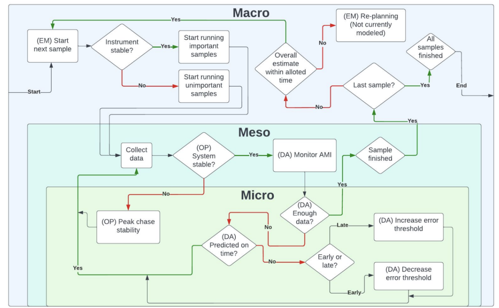
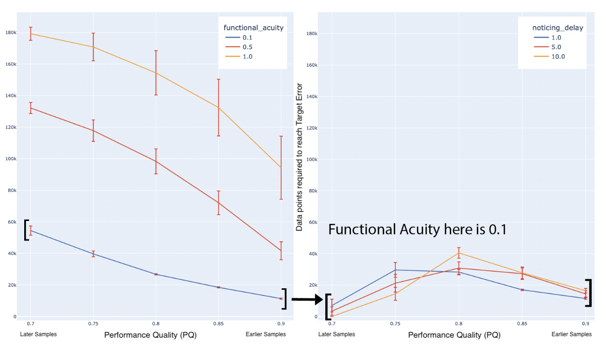
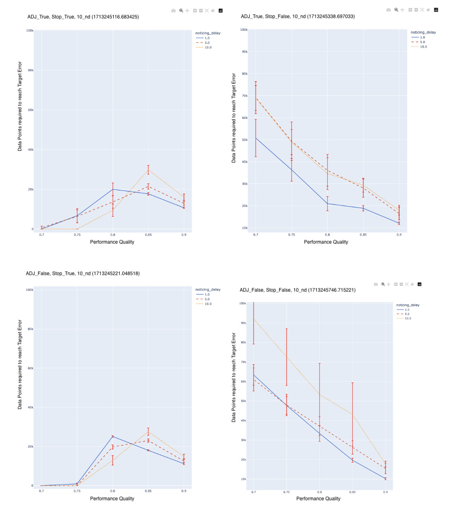

# A multi-scale cognitive interaction model of instrument operations at the Linac Coherent Light Source

**Jonathan Isaac Segal**, **Wan-Lin Hu**, **Paul H. Fuoss**, **Frank E. Ritter**, **Jeff Shrager**

*Rev. Sci. Instrum.* 96, 013005 (2025)  
[https://doi.org/10.1063/5.0239302](https://doi.org/10.1063/5.0239302)

## Abstract
The Linac Coherent Light Source (LCLS) is the world’s first x-ray free electron laser. It is a scientific user facility operated by the SLAC National Accelerator Laboratory, at Stanford, for the U.S. Department of Energy. As beam time at LCLS is extremely valuable and limited, experimental efficiency—getting the most high quality data in the least time—is critical. Our overall project employs cognitive engineering methodologies with the goal of improving experimental efficiency and increasing scientific productivity at LCLS by refining experimental interfaces and workflows, simplifying tasks, reducing errors, and improving operator safety and stress. Here, we describe a multi-agent, multi-scale computational cognitive interaction model of instrument operations at LCLS. Our model simulates the aspects of human cognition at multiple cognitive and temporal scales, ranging from seconds to hours, and among agents playing multiple roles, including instrument operator, real time data analyst, and experiment manager. The model can roughly predict impacts stemming from proposed changes to operational interfaces and workflows. Example results demonstrate the model’s potential in guiding modifications to improve operational efficiency. We discuss the implications of our effort for cognitive engineering in complex experimental settings and outline future directions for research. The model is open source, and the videos of the supplementary material provide extensive detail.

## Citation

> Jonathan Isaac Segal, Wan-Lin Hu, Paul H. Fuoss, Frank E. Ritter, Jeff Shrager; A multi-scale cognitive interaction model of instrument operations at the Linac Coherent Light Source. *Rev. Sci. Instrum.* 1 January 2025; 96 (1): 013005. https://doi.org/10.1063/5.0239302

## Supplementary Material (Videos)

*   [Video 1: Conceptual Overview](https://www.youtube.com/watch?v=FMbpXG7FwXc&list=PLbeZN0bMs7chw7wscW5JQAtfEGSpY-CKi&index=4)
*   [Video 2: Model Demonstration & Results](https://www.youtube.com/watch?v=R_Nl60k7RC4&list=PLbeZN0bMs7chw7wscW5JQAtfEGSpY-CKi&index=5)
*   [Video 3: Code Walk-through](https://www.youtube.com/watch?v=UQwjA9xsKr8&list=PLbeZN0bMs7chw7wscW5JQAtfEGSpY-CKi&index=6)

## Introduction

The Linac Coherent Light Source (LCLS), located at the SLAC National Accelerator Laboratory, is a world-leading x-ray source, hosting hundreds of high energy x-ray experiments annually. These experiments probe fundamental physics as well as the nano-scale, high speed physics underlying fields as diverse as biology, chemistry, and materials science. LCLS beam time is a limited resource that must be efficiently utilized. Our goal is to apply cognitive engineering methods to optimize LCLS user interfaces (UIs) and workflows, enhancing how scientists and engineers gather information, reason, and take action with regard to the system.

Cognitive engineering is a methodology tailored to analyze and improve “human-in-the-loop” settings—those where humans interact with complex engineered systems. The method combines qualitative and quantitative experiments, mathematical analysis, and computer simulations, with the goals of improving efficiency by making tasks simpler and less error prone, improving participants’ safety, and reducing their stress.

## Setting: The Machine and Instruments

The LCLS system involves an enormous number of physical and software components, operated by multiple teams of scientists and engineers. A 2 km-long linear accelerator (hereafter “linac”) and a 200 m long magnetic “undulator” form an x-ray free electron laser (XFEL), often referred to together as “the machine.” The machine produces 120 extremely bright 50 fs x-ray pulses every second, referred to as “the beam.” After propagating through various diagnostics and beam shaping optics, the beam arrives at an “instrument” whose purpose is to collect data about what happens when the beam interacts with materials of interest, generally called “targets” or “samples.”

## Experimental Teams and Virtual Roles

The success of an experiment rides on the team’s ability to rapidly develop an effective team workflow in order to conduct as many measurements as possible with a high SNR on important samples. We identify three “virtual roles”, which are always represented, regardless of the number of separate people involved in an experiment: 

1.  **Instrument Operator:** Actively controls the instrument.
2.  **Real Time Data Analyst:** Analyzes the data flowing from the instrument into the data pipeline.
3.  **Experiment Manager:** Responsible for the overall execution of the experiment and dynamic re-planning.

## A Multi-Scale Cognitive Interaction Model

Our model simulates experimental operations at three cognitive/temporal scales:


*Figure 6: Information flow and inter-scale interaction during LCLS operations. “Micro” reasoning and action is local in time, relating to the moment-to-moment stability of the system required to get any data at all as well as high quality data; “meso” relates to a larger time scale, over multiple data points; and “macro” is at the scale of the entire experiment, over multiple measurements.*

### Micro-cognitive: Peak chasing, functional acuity, and functional operability
In the micro-cognitive domain, we model an abstract task that we call “peak chasing,” a common type of optimization task. The operator’s ability to carry out this task is controlled by two abstract parameters: Functional Acuity (FA) and Functional Operability (FO).

### Meso-cognitive: When to end a measurement
Phenomena at the meso-cognitive scale involve reasoning and decision-making related to whether to continue or abort the current measurement.

### Macro-cognitive: Sample planning and re-planning
Phenomena at the macro-cognitive scale involve reasoning and decision-making related to the course of the experiment, especially regarding how long to gather data on a given sample, and in what order samples should be run.

## Example Results

The following figures demonstrate explorations with the model.


*Figure 7: Left: Varying functional acuity (FA = [0.1, 0.5, 1.0]) with adjust-error = false and cutoff-time = false. Lower FA corresponds to noticing finer misalignments, thus requiring fewer samples to reach TE. Right: Fixed FA = 0.1, varying noticing delay (ND = [1, 5, 10]) with adjust-error = true and cutoff-time = true.*


*Figure 8: Cutoff time (stop) = true across noticing delay (ND) = [1, 5, 10] and adjust-error = [false, true].*

## Code Usage

The simulation is run via `run.py`.

```python
# Typical usage example:
import sim
sim.jig(sim.overrides.macro_test, True, 'functional_acuity')
```

See `sim/` directory for model implementation details.

## Acknowledgments
The research described here arises from a project begun in 2019 by Devangi Vivrekar and Paul H. Fuoss, with guidance from Jeff Shrager. The research was continued by Jeff, Paul, and Teddy Rendahl and then by Jeff, Paul, Wan-Lin Hu, and Jonathan Segal. Use of the Linac Coherent Light Source (LCLS), SLAC National Accelerator Laboratory, is supported by the U.S. Department of Energy, Office of Science, Office of Basic Energy Sciences under Contract No. DE-AC02-76SF00515.
